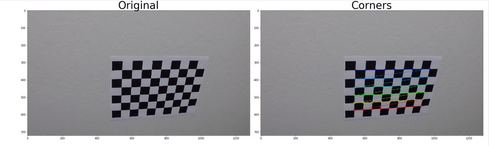
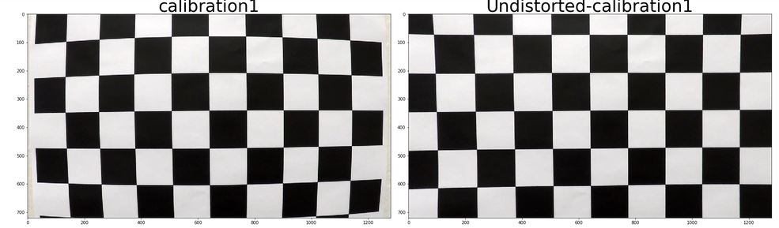
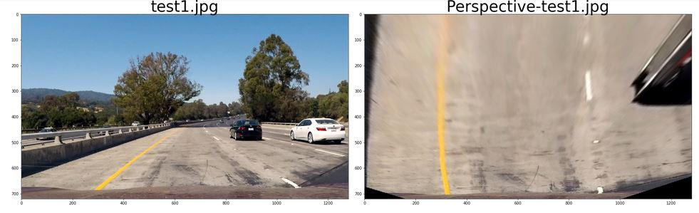
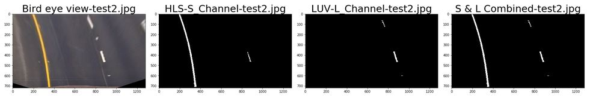
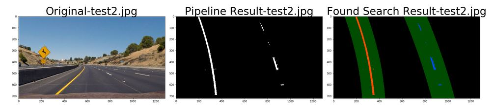

# Self Driving Car - Advanced Lane Lines 

## Overview
Develop a more advanced lane line detection system. The project first discusses camera calibration and how to correct image distortion on the edges of images Next the perspective transform is disccused to get a birds eye view of each image this will provide more accurate lane detection. Gradient edge detection and different color spaces are then explored to determine which color spaces/channels are best for detecting lane colors accounting for differnt lighting and shadows. After we detected lane edges from the birds eye view we then search for lines from pixel intensities on the image and then apply curve fitting techniques to draw lines. Finally we implemeent a video pipeline that reads each image processs the image for lane finding and apply the extrapolated lines and predictions back on the original (unwarped) image.Many aspects of OpenCV, python, numpy, and matplotlib are used to develop the lane finder. The jupyter notebook can be found here: 
[AdvancedLaneLines.ipynb](https://github.com/jfoshea/AdvancedLaneLines/blob/master/AdvancedLaneLines.ipynb)

The steps in this project are :
- Camera Calibration
- Distortion Correction.
- Perspective Transform (Birds eye view)
- Explore Color spaces on birds eye view
- Gradient and Color Threshold.
- Detect lanes using blind_search() and visualize them.
- Detect lanes using found_search() and visualize them.
- Determine the radius of curvature and center offset for the car.
- Create a Class Line().
- Create a video pipeline.
- Run the video pipeline for each video

### Camera Calibration
Camera calibration is needed to accurately detect locations on images taken from different angles and allow any images with distortion to be accuratley undistorted. The OpenCV functions `cv2.findChessboardCorners` and `cv2.drawChessboardCorners` are used to identify the locations of corners on a series of pictures of a chessboard taken from different angles.  The output of chessboard corners are then  used by `cv2.calibrateCamera` to compute the camera calibration matrix and distortion coefficients.
Details about Camera calibration can be found here: 
[OpenCV Camera Calibration](https://docs.opencv.org/2.4/doc/tutorials/calib3d/camera_calibration/camera_calibration.html)

**Example: Calibrated camera image**

### Distortion Correction 
The camera calibration matrix and distortion coefficients obtained in the camera calibration stage are used with the OpenCV function `cv2.undistort()` to remove distortion from the images.

**Example: Distorted corrected image** 

### Perspective Transform 
The perspective transform takes a distorted corrected image and transforms it to show the birds eye view of the road. This allows the lane lines to appear more parallel and not converging. The OpenCV `get.getPerspectiveTransform` and `cv2.warpPerspective` are used to get the perspective view.  The algorithm takes the undistorted image as input along with four source points and four destination points which are manually selected by visual inspection of the source image, and then the algorithm remaps or warps the image.

**Example: Perspective transform** 

### Explore Color and Gradient Selection 
The purpose of this step is to explore various color spaces and channels that provide the best match for lane detection under various lighting and shading conditions. 
The lesson made a good case for converting to HLS color space and than selecting the S channel.  I first performed this step and the S channel and experimented with differnt threshold levels and found that a min threshold of 150 worked well for detecting yellow lanes across all images, however it didnt work so well for white dashed lanes.  For the white lanes I tried HSV, YUV colorspace, but then tried LUV colorspace and I found the L Channel from the LUV color space performed well on the dashed white lane lines. I spent a lot time on changing color spaces and threshold, but I felt using L channel the LUV space was as good as I could get for white lanes. At this point I decided to combine the S-channel for yellow lanes and L-Channel for white lanes and for a complete lane detection thesholding

This project used Sobel edge detection to find line edges: [OpenCV Sobel]( https://docs.opencv.org/2.4/doc/tutorials/imgproc/imgtrans/sobel_derivatives/sobel_derivatives.html). Each image is converted to gray scale and the sobel operators are used to find the edges. The gradient and colot spaces are then combined to complete this step
**Example: Color and Gradient selection**

### Detect lanes

The next step was to fit a polynomial to each lane line, which was done by identifying peaks in a histogram of the image to determine location of lane lines. Next all non zero pixels around histogram peaks using the numpy function numpy.nonzero(). Then fit a polynomial to each lane using the numpy function `numpy.polyfit()`.  After fitting the polynomials I was able to calculate the position of the vehicle with respect to center with the following calculations. For this section I took the suggested blind search and found search code in the lesson as a starting point, I wanted to restructure the code to make it more readable to me, and I also took inspiration [github](https://github.com/georgesung/advanced_lane_detection) which was close to my initial implementaion.

**Example: Blind Search Line Fit**

**Example: Found Search Line Fit**

### Determine the radius of curvature and center offset for the car.

The radius curvature has to be calculated in meters. A pixel to meter transformation is used toand recompute the fit again. The mean of the lane pixels closest to the car gives us the center of the lane. The center of the image gives us the position of the car. The difference between the 2 is the offset from the center.
A good explanation of radius of curvature can be found here: [Radius Of Curvature Tutorial]( https://www.intmath.com/applications-differentiation/8-radius-curvature.php)
The code for radius of curvature and center_offset can be found in 
A detailed writeup of the pipeline construction and challenges are located here: 
[writeup] (https://github.com/jfoshea/SDC-FindingLaneLines/blob/master/writeup.md)
The jupyter notebook can be found here:
[AdvancedLaneLines.ipynb](https://github.com/jfoshea/AdvancedLaneLines/blob/master/AdvancedLaneLines.ipynb)

### Conclusion
I learned a lot of new concepts on this project. I spent most of the times exploring color space and finding an elegant solution to line fitting. I noticed the projection polgon leans slightly to the right sometimes. Videos for lane projection can be found here:
[project_video_out.mp4] (https://github.com/jfoshea/SDC-AdvancedLaneLines/blob/master/project_video_output.mp4)
[challenge_video_out.mp4] (https://github.com/jfoshea/SDC-AdvancedLaneLines/blob/master/challenge_video_output.mp4)

